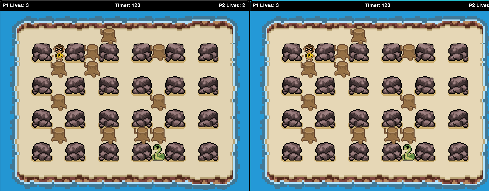
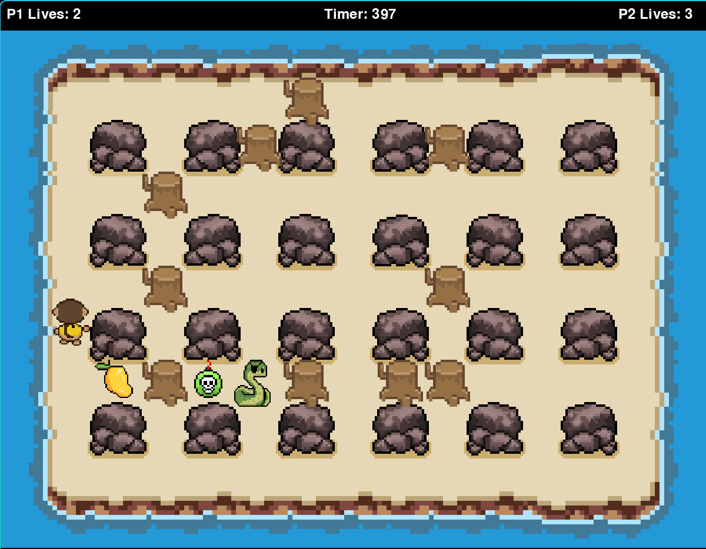
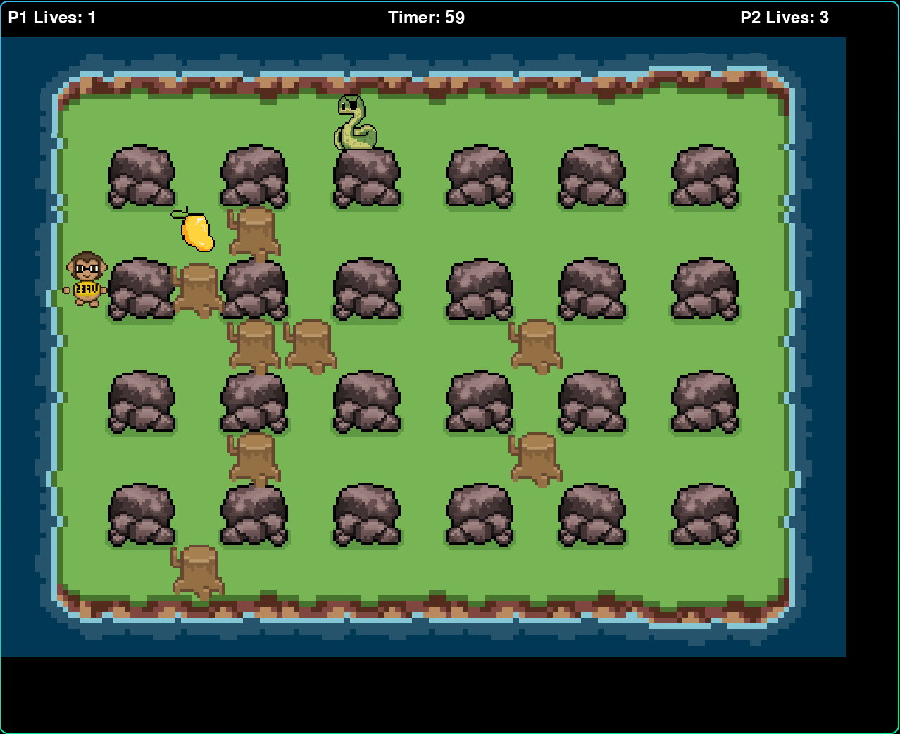

# Overblocked






## How to run the game
Terminal 1 - Server Side
```
python3 server.py
```
Terminal 2 - Client Side - Player 1
```
python3 client.py
```
Terminal 3 - Client Side - Player 2
```
python3 client.py
```
